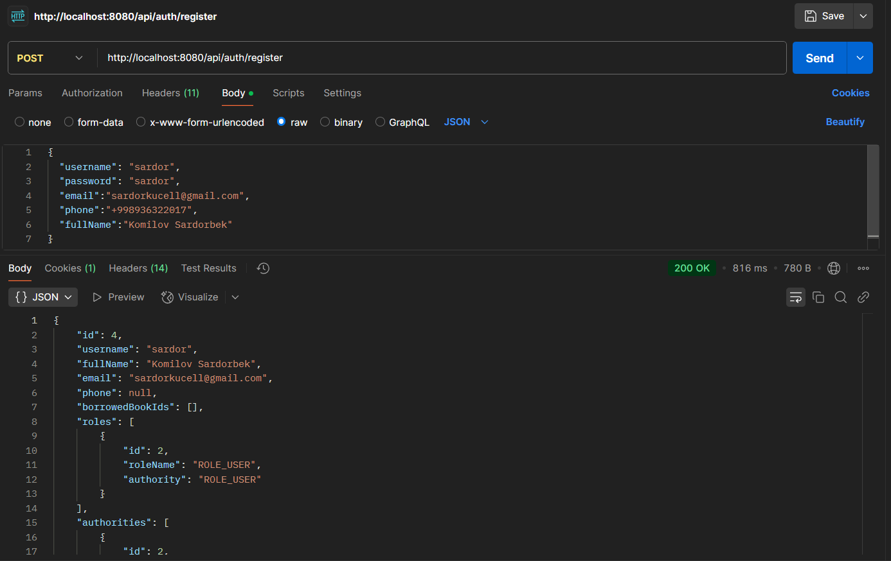
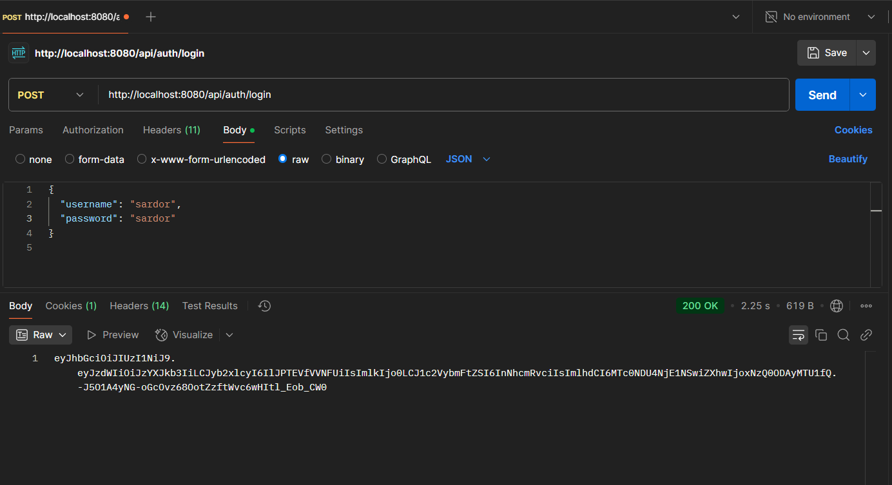
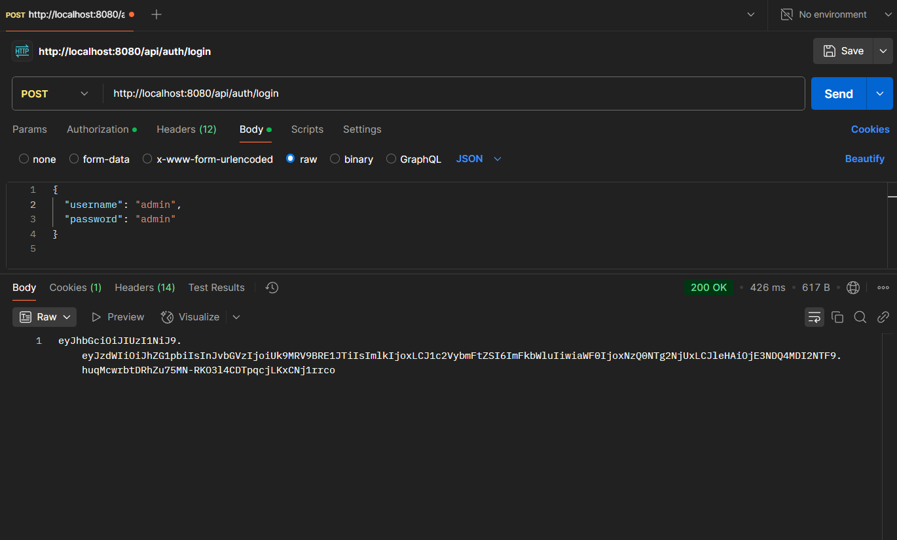
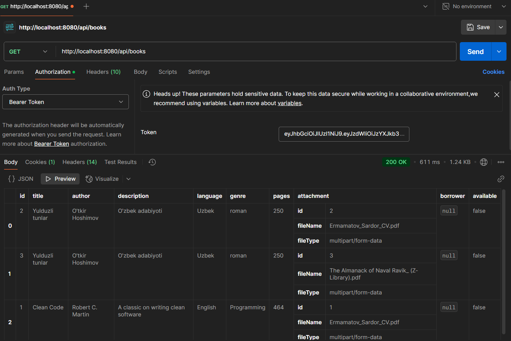
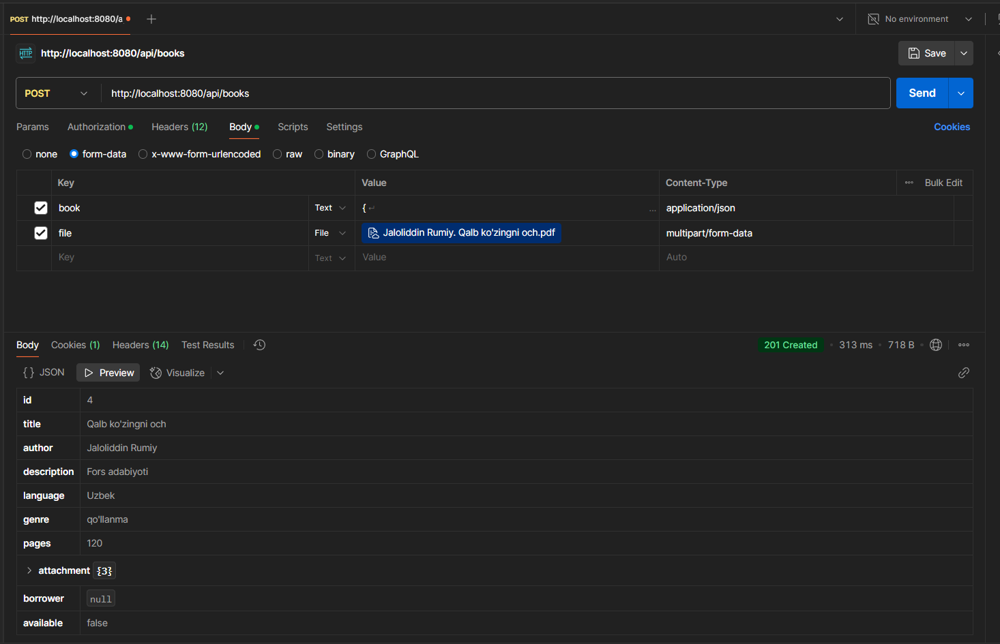
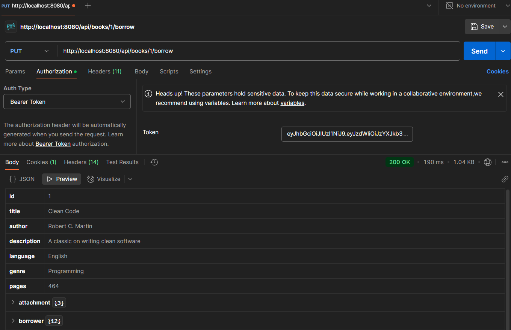
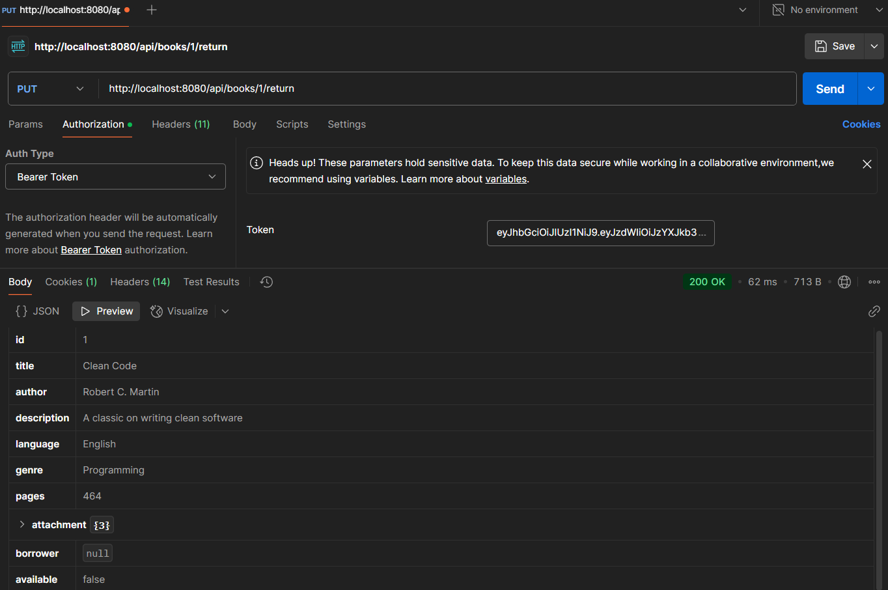
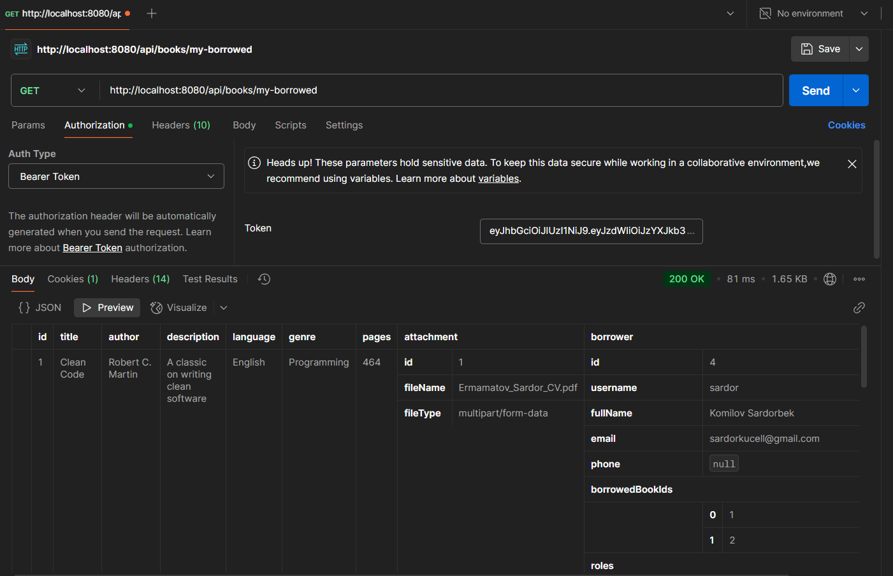

# Digital Library

## 📝 Qisqacha Tavsif
Ushbu loyiha — Elektron kutubxona tizimi, foydalanuvchilarni ro‘yxatdan o‘tkazish, tizimga kirish va kitoblarni qarzga olish imkonini beruvchi backend REST API xizmatidir. Har bir foydalanuvchi faqat o‘zi qarzga olgan kitoblarni ko‘ra oladi. Kitoblar bazasini faqat administrator yangilashi mumkin. API JWT token asosida autentifikatsiya va avtorizatsiyani qo‘llaydi.

Asosiy funksiyalar:

- Foydalanuvchi ro‘yxatdan o‘tishi va tizimga kirishi

- JWT token orqali himoyalangan API'lar

- Kitoblar ro‘yxatini ko‘rish

- Kitobni qarzga olish va qaytarish

- Faqat o‘zi olgan kitoblarni ko‘rish

- Admin tomonidan yangi kitob qo‘shish

## 🚀 Qanday ishga tushiriladi
Quyidagi bosqichlarda dastur ishga tushiriladi:

1. Talablar (Requirements)
- Java 17+ o‘rnatilgan bo‘lishi kerak

- Maven 

- PostgreSQL 

- IDE: IntelliJ IDEA 

2. PostgreSQL bazani sozlash

    1. digital_lib nomli db yaratilinadi
    2. application.properties faylida quyidagicha sozlang

        spring.datasource.url=jdbc:postgresql://localhost:5432/digital_lib
        spring.datasource.username=postgres
        spring.datasource.password=root123
        spring.datasource.driverClassName=org.postgresql.Driver
        spring.jpa.hibernate.ddl-auto=update
        spring.jpa.show-sql=true
        spring.jpa.properties.hibernate.format_sql=true
        spring.application.name=digital_library
        spring.servlet.multipart.max-file-size=100MB
        spring.servlet.multipart.max-request-size=100MB

       ⚠️ Eslatma: port sozlamalaringiz mos kelishini tekshirib ko‘ring!

    3. Table lar yaratilgandan so'ng roles table ning role_name qismiga rollarni manual tartib bilan kiritish to'g'ri bo'ladi
        - ROLE_ADMIN
        - ROLE_USER

    4. Oldindan admin qo'shib olish uchun >> src/main/java/uz/tridev/digital_library/config/DataLoader.java 
        dagi kodlarni o'zingizga moslab sozlab olishingiz mumkin password va username qismini va run bosilgandan 
        so'ng @component annotatsiyasini kommentga olib qo'yishingiz maqsadga muvofiq keyinchalik muommo kelib chiqmasligi uchun.
    
    5. Va nihoyat dasturga qayta run berib ishlatib ko'rishingiz mumkin
    

## 🔐 Autentifikatsiya ishlashi haqida

Ushbu loyihada foydalanuvchi autentifikatsiyasi va avtorizatsiyasi JWT (JSON Web Token) asosida amalga oshiriladi. Bu orqali foydalanuvchilar tizimga xavfsiz tarzda kirishlari va faqat ruxsat berilgan endpointlardan foydalanishlari mumkin.

1. Ro‘yxatdan o‘tish (user)
    Foydalanuvchi POST /api/auth/register endpointi orqali ro‘yxatdan o‘tadi. Yuborilgan parol bcrypt algoritmi orqali xesh qilinib, xavfsiz tarzda bazaga saqlanadi.

    namuna:
                {
                    "username": "sardor",
                    "password": "123",
                    "email":"sardorkucell@gmail.com",
                    "phone":"+998936322017",
                    "fullName":"Komilov Sardorbek"
                }

2. Tizimga kirish
    Foydalanuvchi POST /api/auth/login orqali login va parolni yuboradi. Agar ma’lumotlar to‘g‘ri bo‘lsa, unga JWT token qaytariladi.

    namuna:
                {
                    "username":"sardor",
                    "password":"123"
                }

   natija:      {
                "token": "eyJhbGciOiJIUzI1NiIsInR5cCI6IkpXVCJ9..."
                }

3. Himoyalangan endpointlarga kirish
    Token HTTP so‘rovining Authorization sarlavhasida yuboriladi:
    Authorization: Bearer <JWT token>

4. Rollarga asoslangan kirish (Role-based access)
        Ba’zi endpointlar faqat ma’lum rollarga ega foydalanuvchilargagina ochiq. 
        Masalan:
        POST /api/books — faqat admin roliga ega foydalanuvchi qo‘shishi mumkin.
        PUT /api/books/{id}/borrow — tizimga kirgan istalgan foydalanuvchi foydalanishi mumkin.

## 📬 API Namunalari (Postman)

- /api/auth/register (POST)

- /api/auth/login (POST)

- /api/books (GET)

- /api/books (POST)

- /api/books/{id}/borrow (PUT)

- /api/books/{id}/return (PUT)

- /api/books/my-borrowed (GET)
